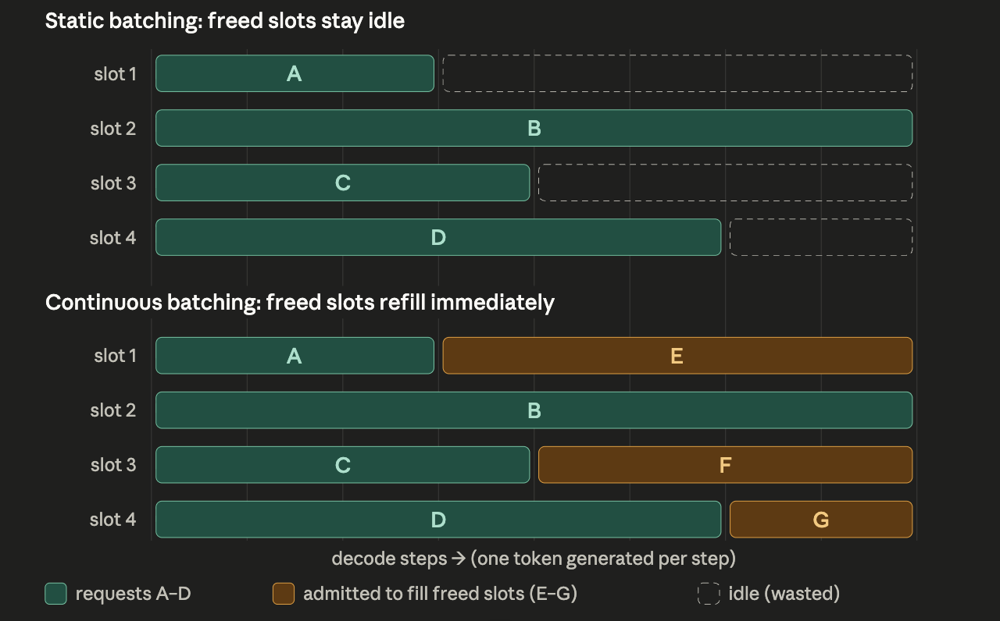

[checkpointing](#checkpointing)   
[Deduping large data points](#dedup)   
[Data Ingestion Systems](#dataingestion)   
[Data storage + streaming](#datastreaming)   
[Lucene in Search](#lucene)   
[Cross-Attention](#crossattn)   
[Inference Pipeline](#inference)   
[Tokenizers](#tokenizer)   
[QKV Breakdown](#qkv)   
[Transformer's Components](#transformer)   
[Transformer's Supporting Concepts](#transformer2)   
[BPC](#bpc)   
[Abstractions in storage](#storageabs)   
[Notification System Design](#notificationsystem)   
[Tricky bits in a notification system](#notificationhardparts)   
[On-Policy Distillation](#opd)   
[Forward KL vs Reverse KL](#reversekl)   
[Message Brokers](#brokers)  
[MapReduce](#mapreduce)  
[Skewed workdloads in a KV store](#skew)  
[Partitioning](#sharding)   
[Change Data Capture](#cdc)   
[Change Data Capture in Search](#cdcsearch)   
[Reliability in Data Systems](#reliability)   
[Scaling up vs Scaling out](#scaling)   
[OLTP vs OLAP](#olap)  
[Storage Engines](#engine)  
[Cross Domain RecSys problems](#cdr)  
[Stages of Model Training](#posttraining)  
[Small Language Models](#slm)  
[Pointwise Attention](#pattn)  
[Softmax is a weighting scheme](#softmax)  
[Deconvolution Layer](#deconv)  
[Batch Normalization](#batchnorm)  
[Q-learning v SARSA](#qlearningsarsa)  
[Policy Iteration v Value Iteration](#policyvalue)   
[Q Learning](#qlearning)  
[Policy Gradients](#policygrad)  
[Actor Critic methods](#actorcritic)  
[Trust Region Methods](#trpo)  
[Monte Carlo Tree Search](#mcts)  
[Inverse Reinforcement Learning](#irl)  
[One shot learning](#oneshot)  
[Meta learning](#meta)  
[A3C](#a3c)  
[Distributed DL](#ddl)  
[MAC vs Digital Signatures](#mac)  
[MLE and KL Divergence](#mle)  
[Lipschitz Continuity](#lips)   
[Exposure bias problem](#bias)   
[Gini coefficient](#gini)    
[Pareto distribution](#pareto)    
[Mixture of Experts](#moe)    
[GRPO](#grpo)    
[GPU Comms](#gpucomms)    
[Async SGD, Hogwild](#asyncsgd)    

---

## <a name='checkpointing'><a>Checkpointing

* Optimizer a state is significantly more than weights. It takes up majority of the size of the distributor checkpoint.
    *  Weights are 2 bytes/param in bf16, but Adam adds ~12 (fp32 master + two moments in fp32 each), so a checkpoint is ~14 bytes/param — a 70B model is ~1 TB. Basically models train in fp16, but optimizer is in full precision for stable updates.
* Tiered checkpointing: Use fast local storage like NVME for frequent check pointing; For more durable checkpoints that are less frequent hit the storage.
* Async checkpointing: do the expensive D2H, then continue with the job in the background process move the checkpoints from the CPU to the storage.
* Checkpoint using a resharding / topology-agnostic format for easlier restarts (After some processing) on node failures or changed model configurations.

---

## Deduping large data points

* It's feasible and routine — but not naive Lloyd's over all billion points; you use FAISS (GPU-accelerated, built for billion-scale) rather than something like scikit-learn.
* Fitting scales with K, not N — you train the centroids on a sample sized to the number of clusters (~30–256 points per centroid), so a few million points suffices even for large corpora; only the final assignment pass touches all billion, and that's a single parallel streaming job.
* Standard accelerants make it cheap — mini-batch updates, PCA/random-projection down from 512–1024 dims, and PQ compression (~64 bytes/vector, so a billion fit in ~64 GB RAM instead of ~2 TB).
* For dedup you only need coarse clustering — its job is just to bucket likely-duplicates together (it's essentially the coarse quantizer of a FAISS IVF index), so approximate is fine; the one tradeoff is boundary misses, fixed by multi-probing each point's nearest few clusters.

---

## Data Ingestion Systems

* Think of it as a DAG: ingest → normalize → chunk/process → embed → index → serve, with quality and curation layered throughout.
* Content-addressed storage (hash → blob) gives free exact deduplication and idempotency. Object storage is the source of truth; a metadata catalog indexes it. Metadata can be used for all sorts of purposes, until you need the blobs themselves.
* Metadata extraction: resolution, codec, duration, fps, source, timestamps.
* Format normalization: data inputs can be in variable formats. You need a uniform yet broad formats to encode cleanly as well as do it efficiently and as lossless-ly as possible.
* Processing / chunking — choosing the unit of embedding. A central decision is what gets embedded, across different modalities (audio, episodes, image, video).
* Embedding generation at scale: CLIP (and its variants), CLAP/wav2vec for audio, text embedders for captions/transcripts. A shared/joint embedding space is the thing that makes cross-modal search work.
    * It's a throughput problem. Embedding billions of items is a distributed, fault-tolerant batch job.
    * Incremental and idempotent: only embed new or changed content.
    * Embedding-model versioning: when you upgrade your encoder, every old vector is in a different space and incomparable. 
* Storage and indexing: Vector / ANN index; The index trade-off triangle is recall vs latency vs memory, with quantization of vectors as the lever for scale.
    * Hybrid search: combine vector similarity with metadata filters
    * Sharding, replication, and freshness — how quickly newly ingested content becomes searchable.
*  Quality and curation
    * Dedup: exact via hashing, near-duplicate via perceptual hashing or embedding similarity.
    * Filtering: NSFW removal, quality and aesthetic scoring, CLIP-score filtering for image-text alignment.
    * Decontamination: dedup training data against eval sets so benchmarks aren't leaked.
    * Synthetic annotation: use a VLM to caption or label media — closing the flywheel by generating training signal.

---

## Data storage + streaming

* Two main points to consider for data infra supporting AI workloads: massive volume, heterogenous shape and sizes
* Typically data sets are sharded optimized for sequential reads.
* Different data formats exist, such as webdataset, MDS Parquet, Lance, or LeRebot for robotics. There is no one-size-fits-all. Each format comes with its own advantages or limitations.
    * Format choice is a function of the axis patterns, the storage constraints, and the pipeline mechanics (that is, Workflow is compute bound or data bound. It's happening off-line or online).
    * Data format axis for consideration: A. Metadata B. Row vs columnar C. compression D. encryption E. readheavy or writeheavy optimized, F. sharding implementation 
* Start shuffling at large scale look like? Typically, you shuffle shards and have a shuffle buffer of size N to read from. Optimize these based on your compute/storage/CPU etc.
* On Batching:
    * Variable length sequences: Sequence packing, Token budget batching (aim to fill a certain tokem amount in the batch, rather than a fixed number of samples)
        * With this optimization the way you compute the loss has to change as well. You shouldn't average the loss based on the number of roles or samples in the batch, but based on tokens (for token budget batching).
        * For sequence packing, don't forget masking to prevent attention from looking over sequence boundaries.

---

## Lucene in Search

* It maintains the specialized retrieval structures a KV store can't: an inverted index (term → ranked posting lists) for full-text, plus doc values for facets, BKD trees for range filters, and HNSW for vector search — all in one engine.
* Its analysis pipeline (tokenizing, lowercasing, stemming, synonyms, n-grams) is what turns "exact title match" from brittle into robust, giving you typo tolerance and partial matching.
* It scores candidates by relevance (BM25 - similar to TF-IDF) at retrieval time, so you get a strong first ranking signal for free before any ML ranker runs.
* It's the actual engine under Elasticsearch/OpenSearch/Solr — understanding it means you understand what every layer above is really doing.
    * ElasticSearch sits on top of Lucene. It shards indexes across multiple nodes and machines to handle massive datasets; fault tolerance; cluster management, basically everything to manage your storage engine without working directly with Lucene.

---

## Cross Attention

* Bridge between modalities — Cross-attention lets one modality (e.g. text) query another (e.g. image) using Q from one and K, V from the other, so information flows across without forcing both into the same representation space.
* Flexible fusion — The model learns which parts of one modality are relevant to which parts of another (e.g. the word "dog" attends to the dog region in the image), making it dynamic and content-dependent rather than a fixed merge.
    * During cross-attention, for each text token the model computes a score against every image patch.
    * The model is trained on millions of image-caption pairs with a loss like:
        * Captioning loss — predict the next word given the image; to predict "dog" correctly, the model must find the dog in the image patches
        * Contrastive loss (CLIP-style) — pull together matching image-text pairs globally
    * Through backpropagation, the Q and K projection matrices adjust so that semantically related concepts develop similar vector directions 
    * i.e. We don't explicitly ensure it — the model learns it from data. This happens because of large scale training, lots of data, good loss function design and gradient descent 
* Keeps encoders decoupled — Each modality can be encoded independently (even with frozen pretrained encoders), and cross-attention acts as the learned bridge — enabling efficient architectures like Flamingo where only the cross-attention weights are trained.

---

## Inference pipeline

* Prefill – this is the first stage, when the model reads the entire prompt and builds understanding of the context. Since all prompt tokens are already known, this step can be heavily parallelized and runs very fast on the GPU. 
    * Prefill produces the first output token and populates the KV cache.
* Decode – the model generates the response one token at a time. Each new token depends on the previous ones, so this stage is mostly sequential and slower.
    * Each step is a forward pass that processes only one new token — but to do so it must read all the model weights and the entire KV cache from memory. The amount of math per step is tiny relative to the amount of data moved. This phase is memory-bandwidth-bound: the bottleneck is how fast you can stream weights and cache out of GPU memory, not how fast the GPU can multiply.
* Metrics (tail latencies matter more than averages): 
    * TTFT: mostly prefill latency,
    * TPOT: mostly decode latency. So, total latency is approximately: TTFT + (TPOT × number of output tokens).
    * End-to-end latency
    * Throughput
    * Goodput: throughput of requests that met their latency SLO
* Prefill requires more compute, while decode is memory-bandwidth-bound.
* First we do tokenization and creation of token embeddings (RoPE fits in here). Then comes attention (first as prefill then later in decode as well).
* During attention, each token computes a query (Q), key (K), and value (V) vector, and attends to the keys and values of all previous tokens. Without caching, generating token N would mean recomputing the K and V for all N−1 prior tokens at every step — quadratic, wasteful work.
    * Instead we cache the K and V tensors for every token already seen, in every layer.
    * Q vectors are always ephemeral; only K and V are ever cached
* The cost is memory. The KV cache size is roughly:
    * kv_bytes ≈ 2 × n_layers × seq_len × n_kv_heads × head_dim × dtype_bytes × batch_size
    * The 2 is for K and V. This grows linearly with both sequence length and batch size, and it lives in scarce GPU memory alongside the model weights.
* The KV cache, not the weights, usually limits how many concurrent requests fit on a GPU.
* Anything that shrinks it pays off directly. Grouped-Query Attention (GQA) and Multi-Query Attention (MQA) let multiple query heads share fewer K/V heads, cutting n_kv_heads and shrinking the cache several-fold — which is why nearly all modern serving models use them.
* Long contexts are expensive in memory, not just compute. A single 100K-token conversation can consume gigabytes of KV cache.
* Batching
    * Static: Collect N requests, run them together until all finish.
    * Dynamic: Wait a few milliseconds to gather whatever requests arrive, then run that batch
        * Both suffer from “wait for the slowest" problem for variable-length generation.
    * Continuous (aka in flight batching): see ss. Every empty slot if filled with another request
    * 
    * "Batch size" stops being a fixed number you configure and becomes "however many sequences happened to be in this step,
    * There is chunked prefill to remedy some kinks that arrive with this setup.
* For memory management, look at PagedAttention and prefix caching.
* More optimizations: quantization, speculative decoding, chunked prefill, prefill–decode disaggregation, FlashAttention.
* Routing starts playing a big role in KV cache efficiency.
* The fundamental trade-off restated in metrics terms: bigger batches → higher throughput but worse per-request latency^^
    * Your SLO defines how far you can push.
    * The goal is to track demand closely enough to hold your latency SLO without paying for idle GPUs you don't need.
    * ^^ conditions apply: this depends on many factors and may not be true all the time. A lot depends on how requests are scheduler and how ‘smart’ is the scheduler

---

## Tokenizers

* Writing a text tokenizer means building and applying a vocabulary via an algorithm like BPE — normalize, pre-tokenize, merge, encode to IDs. 
* "Tokenizing" an image means imposing sequence structure on a pixel grid, either by slicing it into patches and linearly projecting them into continuous embeddings (ViT, the common case), or by encoding it and quantizing to discrete codebook indices (VQ-VAE, when you need true discrete tokens for generation - typically for 'image-as-language models' those working on images autoregressively; diffusion models are in the ViT bucket). 
* Text tokens come from frequency statistics over a corpus; image tokens come from learned projections or learned codebooks.

---

## QKV Breakdown

* Self-attention allows tokens in a sequence to dynamically route context to one another. Every token is projected into three vectors:
    * Query ($Q$): What a token is searching for (the "search string").
    * Key ($K$): What a token contains (the "index/tags" used for matching).
    * Value ($V$): The actual semantic content passed along once a match is made.
* $$\text{Attention}(Q, K, V) = \text{softmax}\left(\frac{QK^T}{\sqrt{d_k}}\right)V$$

* Step-by-Step Mathematical Workflow
    * Similarity Scores ($QK^T$): The Query matrix multiplies with the transposed Key matrix. This creates an $(N \times N)$ matrix of dot products representing how much every token cares about every other token.
    * Scaling ($\div \sqrt{d_k}$): The raw scores are divided by the square root of the key dimension. This prevents extreme values and stabilizes gradients during training.
    * Normalization ($\text{softmax}$): A row-wise softmax converts the scaled scores into a clean probability distribution where each row sums to $1.0$ ($100\%$).
    * Information Routing ($\times V$): The probability matrix multiplies the Value matrix. The final output for each token is a weighted sum of all values in the sentence, baked full of context.

* K and Q decide "how" we are looking at other tokens, and V decides "what" it is for every token
    * $Q$ and $K$ form the "Routing Layer": They determine how much the model should look at every other token. It is purely about calculating the relationships, syntax, and relevance.
    * $V$ is the "Information Layer": It holds the actual semantic meaning—the what—that gets moved across the network once those relationships are established.

---

## Transformer's Components

* Tokenizer: Splits raw text into chunks (tokens) and maps each one to an integer ID using a fixed vocabulary.
* Token Embeddings: the model's first layer. Swaps each integer ID for a 128-dimensional vector of floats. These vectors are learned
* Positional Embeddings:  added on top of the word embeddings; inject the order by giving each position its own learned vector. Now each token carries both what it is and where it sits.
* Transformer encoder layers — the core of the architecture, stacked on top of each other. Each layer runs multi-head self-attention: every token looks at every other token and updates its own representation based on what it sees. Multiple attention heads run in parallel, each learning to track a different type of relationship. After several layers, each token's vector has been deeply enriched with context from the whole sentence. Early layers tend to learn syntax, later layers learn semantics.
* Mean pooling — after the encoder, you have one vector per token. To classify the whole sentence you need one vector, so you average all the token vectors together. This collapses (seq_len, 128) → (128,), a single summary of the sentence's meaning.
* Linear classifier — takes that 128-dim summary vector and maps it to N scores, one per class. The highest score is the prediction.

---

## Transformer's Supporting Concepts

* Padding — real-world sentences have different lengths but GPUs need rectangular grids. Shorter sequences get padded with a dummy token to match the longest in the batch. A padding mask is passed alongside the input so the attention mechanism knows to ignore those positions completely.
* Multi-head attention — instead of one attention pass, you run nhead passes in parallel, each with independent weights. Each head specializes in a different kind of relationship. Results are concatenated and projected back to the original size. The constraint: d_model must divide evenly by nhead, since the vector gets split equally across heads.
* Encoder vs decoder — an encoder reads the whole input simultaneously in both directions, building a rich understanding of existing text. It's best for classification, search, named entity recognition, and question answering. A decoder generates new text one token at a time, only looking backwards — that's what models like GPT and Claude use. Encoder-only models like BERT dominated NLP benchmarks for years without ever generating a single word.

---

## BPC Scoring

* The Core Definition: Bits Per Character (BPC) evaluates character-level language models by measuring their average uncertainty (in base-2 bits) when predicting the next character in a text sequence, where lower scores mean better text understanding and predictability.
* The Loss-to-Bits Mapping: In information theory, there is a fundamental rule: the more predictable an event is, the fewer bits you need to communicate it. Because standard cross-entropy loss ($\ln$) and bit-encoding ($\log_2$) both mathematically compute a character's negative log-probability, a model's loss in "nats" is directly proportional to the physical bits needed to encode that character—specifically, multiplying cross-entropy loss by $\approx 1.44$ yields the exact BPC score.

---

## Abstractions in storage

* Storage comes in three abstractions — block (raw disk you format yourself), file system (ready-to-use directory tree via POSIX), and object (flat key→value namespace via HTTP API). The big distinction between file and object is that file system is hierarchical and OS-mounted; object is flat, stateless, and always accessed through an API.
* Network vs local is a separate axis from storage type. Block and file system can be either local or remote; object is always remote. Local NVMe block storage is the fastest option (~0.1 ms), network file system adds protocol overhead (~1–10 ms), and object storage is slowest because every operation is an HTTP round-trip (~10–100 ms).
    * NFS maintains a persistent connection between your machine and the file server. When you read() a file, the kernel sends a binary RPC (Remote Procedure Call) directly over TCP/IP to the NFS server. It's a thin, purpose-built protocol with minimal overhead.
    * For object storage (eg S3), every single operation is a full HTTP request. There are HTTP headers, request sent to a load balancer, persmissions, data retrieved and streamed back as an HTTP response, etc. It can't beat NFS.
* NVMe is disk, not RAM — but fast disk. It uses flash chips (no moving parts) over a PCIe bus (not the bottlenecked SATA interface), which is why it feels RAM-like. The key difference: RAM is ~1000× faster but volatile (forgets on power loss); NVMe is persistent. It sits in a unique sweet spot — the fastest durable storage that exists.

---

## Tricky bits in a notification system

* Fan-out — Problem: one comment.created for a popular post means notifying 50k+ followers; doing it in one consumer blocks a partition. Solution: two stages — stage 1 resolves the recipient list and emits N small notification.requested messages; stage 2 workers process them in parallel. Celebrities get chunked into batches, or switch to pull-on-read at extreme scale.
* Replay / durability — Problem: consumers crash, providers go down, bugs mis-send for an hour. Solution: a log-based queue persists and replicates messages and retains them; consumers track an offset, so you reset the offset backwards to reprocess. (Traditional queues give retry but delete on ack, so no replay.) Buffering absorbs spikes via backpressure.
* Thundering herd — Problem: a million "9am digest" sends fire at exactly 09:00:00 and overwhelm dispatchers and provider rate limits. Solution: store send_at in UTC (so "9am local" is one absolute time), then add jitter to spread sends across a window (09:00–09:15) for a steady drain rate.
* Dedup — Problem: at-least-once delivery plus retries, scheduler restarts, and replay all risk double-sending. Solution: every notification carries an idempotency key; dedup at the dispatch boundary gives effectively-once from the user's view. (Never claim true exactly-once.)

---

## Notification System Design

* On a high level there are 4 layers: 1) notification event creation / producers 2) Processing layer / consumers 3) priority/channel queues 4) notification dispatchers to the product layer
    * Kakfa based queues sit between layer 1 and layer 2 ( part of ingestion)
    * Layer 3 and 4 is post-processing and smart handling, product logic can go in there
* Three entry paths converge into one shared pipeline: an express near-empty queue for OTP/2FA, partitioned event topics (Kafka) for triggered notifications, and a UTC time-store + scheduler for scheduled ones.
* A processing layer (consumer group) runs once for all paths: checks user preferences, does fan-out, dedup, and rate-limiting, then renders content and emits one message per recipient.
* Output splits by two axes — priority queues first (OTP beats marketing), then per-channel queues/dispatchers (push/SMS/email) — so a slow provider or a bulk campaign can't block critical traffic.
* A status store tracks sent/delivered/failed and a dead-letter queue catches poison messages, with retries and backpressure throughout.

---

## On-Policy Distillation

* he student generates its own trajectories (including its own mistakes), and the teacher scores every token — not just whether the final answer was right. This gives a dense signal rather than the sparse "right/wrong" feedback of RL.
* Because the student trains on states it visits rather than states the teacher visits, it learns to recover from its own errors — fixing the compounding drift problem of off-policy distillation.
* It optimizes reverse KL: the student is pushed away from tokens the teacher finds unlikely, token by token, across its own rollouts.

---

## Forward KL vs Reverse KL

* Forward KL trains on the teacher's samples — the student is penalized for missing things the teacher does. It's "mean-seeking": the student tries to spread probability mass across everything the teacher might do, even if that means being mediocre across many modes.
* Reverse KL trains on the student's samples — the student is penalized for doing things the teacher wouldn't. It's "mode-seeking": the student commits hard to imitating one strong behavior rather than hedging across many.

---

## Message Brokers

* A message broker is middleware that sits between services, decoupling producers (who send messages) and consumers (who receive them). Instead of Service A talking directly to Service B, both talk to the broker — A deposits a message, B picks it up when ready
    * Core patterns: queues (one producer → one consumer, each message processed once) and pub/sub topics (one producer → many consumers, each gets a copy). Common systems: Kafka, RabbitMQ
* It provides decoupling between producers and consumers. 
* It shifts the focus on fault tolerance and bottleneck handling from consumers/producers to the broker. So if the broker does the job well, things should scale well.
* Other advantages: load leveling — smooths out traffic spikes; consumers process at their own pace; Async workflows — producers don't block waiting for a response.
* Rule of thumb: brokers shine when services have mismatched throughput or availability, or when you need fan-out to multiple consumers. They're overkill for simple, tightly-coupled request/response flows where latency matters most. Remember don't add something _just_ because you know it exists.

---

## MapReduce
* MapReduce is a programming model for processing large datasets in parallel across a distributed cluster.
* Map → Shuffle → Reduce: Input data is split into chunks, a map function processes each chunk into key-value pairs, those pairs are shuffled/sorted by key, then a reduce function aggregates them into a final result (e.g., counting word frequencies across millions of documents).
* Fault-tolerant but batch-oriented: It handles node failures gracefully by re-running failed tasks, but it writes intermediate results to disk between stages — making it slow and ill-suited for iterative algorithms or anything requiring low latency.
* Largely superseded for most use cases: Frameworks like Spark (in-memory processing, 10–100× faster for iterative workloads), Flink (true streaming), and Dask/Ray (Python-native) have replaced MapReduce for most analytics. MapReduce's paradigm lives on conceptually, but systems like BigQuery or Snowflake abstract it away entirely behind SQL.
* The core idea — distribute work, process locally, then aggregate — remains foundational. But the original Hadoop MapReduce implementation is now mostly a historical artifact in production systems.

---

## Skewed workdloads in a KV store

* Key Salting — Append a random suffix to spread one key across N partitions. Writes go to a random shard; reads fan out to all shards and merge. Best for: write-heavy hot keys. Trade-off: read fan-out cost.
* Caching Layer — Place Redis/Memcached in front of the hot key to absorb reads before they hit the DB. Best for: read-heavy, infrequently changing values. Trade-off: cache invalidation complexity on writes.
* Read Replicas — Replicate the hot partition and load-balance reads across replicas. Best for: read-heavy workloads. Trade-off: replication lag; writes still bottleneck on the primary.
* Local (In-App) Cache — Store the hot value in each app server's memory. Zero network hops. Best for: stable, frequently read values like configs or feature flags. Trade-off: stale data risk; high memory usage at scale. See _memoize_ in Python for similar idea.
* Write Buffering/Batching — Queue writes (e.g. via Kafka) and flush to the DB in batches. Best for: write-heavy, bursty traffic. Trade-off: introduces write latency and eventual consistency.
* Counter Sharding — Split a counter key into N shards, increment a random one on write, sum all on read. Best for: aggregation keys like likes, views, or scores. Trade-off: read requires aggregating all shards.

---

## Partitioning

* Why shard? Scalability. Distribute query load. Same idea as in SIMD or Data Parallel training
* Challenges to consider: data ordering - after sharding do you know the order? Read time data order matters too - you don't want one shard being a _hot spot_.
* There are two main approaches to partitioning: key based, or hash based
* At some point, one may need to rebalance the paritions to handle the growing or changing demands. 
    * Rebalancing is hard and shouldn't be done often. There has to be minimum requirements that need to be stated before rebalancing
    * You should know what is changing and what is not. For eg, total logical partitions can change but actual partitions set by the user during setup shouldn't. You can decide if you want to move the entire parition to a single node, or split it across nodes.
    * For an optimal partition size: trade-off overhead of small partitions vs recovery costs for larger partitions. A lot depends on read and write access patterns.

---

## Storage Engines

* Storage engines handle physical data I/O — they translate SQL queries into actual read/write operations on disk, managing how data is laid out and cached in memory.
* They enforce reliability and concurrency — handling transactions (ACID), crash recovery (WAL), and multi-user access control so data stays consistent.
* Different engines suit different workloads — e.g. InnoDB for transactions, RocksDB for write-heavy loads, columnar engines for analytics.

---

## Change Data Capture

* Replication keeps identical copies of your database in sync (MySQL → MySQL); CDC turns every database change into an event stream that any system can consume — Elasticsearch, Redis, a data warehouse, all at once.
* Replication is tightly coupled — a lagging replica affects failover decisions and read freshness; CDC consumers are independent, each processing the stream at their own pace without affecting the source or each other.
* Replication is infrastructure-level plumbing you mostly don't see; CDC is an explicit, queryable audit log of every insert, update, and delete — a first-class artifact you can replay, rewind, or route to new consumers added later.
* See CDC in Search for more details.

--- 

## Change Data Capture in Search

* High-level: DB -> CDC connector -> Kafka → Consumer/Indexer -> ES 
* CDC reads the DB's own write-ahead log (WAL/binlog), so every insert/update/delete is captured reliably in commit order — avoiding the dual-write divergence and the missed-deletes problem of polling.
* Kafka decouples the two systems (ES being down just backs up the queue, nothing is lost) and is a replayable, ordered log — which is exactly what makes full reindexes and new indexes cheap.
* The consumer/indexer is where enrichment lives — embeddings, LLM bucketing, denormalization — kept off the query path, then bulk-upserted with whatver id and external versioning for idempotent, in-order writes.
* It keeps ES as rebuildable derived state with the DB as source of truth, at seconds-level freshness (consumer lag is your staleness metric); if the SLA is days, drop it for a nightly batch rebuild instead.
* Meta point:
    * The unifying principle: whenever you have one source of truth and N derived systems that each need the same data in a different shape, kept fresh, without dual writes, this pattern fits. Martin Kleppmann calls it "turning the database inside out" — the change log becomes the integration point for your whole architecture, and each consumer is just a different projection of it. Search, cache, warehouse, and event bus are all the same move.

--- 

## Reliability in Data Systems

* Sync vs Async
    * Synchronous: Write confirmed after all replicas ack + Zero data loss on failover; higher write latency; replica lag = stall
    * Asynchronous: Write confirmed after primary only + Low latency; replica lag doesn't block; data loss window if primary crashes
* Sync vs async — the core tension
    * Sync = durability guarantee, but every write is only as fast as your slowest replica. One lagging replica stalls all writes.
    * Async = low-latency writes, but if the primary crashes before replication completes, you lose that data. Most systems default here and accept the risk.
    * Semi-sync (MySQL's approach) is a common middle ground — wait for ack from just one replica, not all.
* Replication lag anomalies
    * Async lag creates user-visible weirdness: you submit a form and immediately refresh to see it missing. The fix is to route reads-after-writes back to the primary, or track the user's write timestamp and only serve reads from replicas that have caught up.
    * Monotonic reads: a user shouldn't see data "go backward" if their requests land on different replicas at different lag levels. Pin users to a specific replica or use session-level consistency tokens.
    * Consistent Prefix reads: users should see the data in a sstate that makes causal sense; establish this-happened-before-that dependencies (as relibly as you can).
* Failed replicas
    * Follower failure: straightforward — it reconnects, replays the replication log (WAL) from its last known position, catches up, and rejoins.
    * Leader failure: much harder. You detect the outage (usually via timeout/heartbeat), elect the most up-to-date follower, and update clients to point at the new leader. Key risks:
        * The new leader may be behind, meaning some writes are lost. Do you discard them or try to reconcile?
        * Split-brain: the old leader comes back and both nodes think they're in charge.
* Leader-based replication funnels all writes through a single node to establish a definitive ordering of changes, which are then propagated to followers. Reads can be served by any replica, scaling read throughput horizontally — but followers may lag behind the leader, so reads can return stale data. This is the classic availability-vs-consistency tradeoff: you get read scalability, but only the leader is guaranteed to have the latest state.
    * You can add hecks to ensure the user is being served on the freshest data based on its past write history
* When replication lag grows large, you have a few levers:
    * Detect and monitor
    * Protect reads from stale data
        * but this can mean increased pressure on the fresh replicas or leaders
    * Reduce the lag itself:
        * Identify the bottleneck: is it network bandwidth, replica I/O throughput, or a single large transaction holding up the stream?
        * Parallelize replication — most modern DBs support multi-threaded or parallel apply on replicas to keep up with high write volumes.
        * Reduce write pressure on the primary: batch writes, avoid long-running transactions that create huge replication events.
* Architectural responses:
    * If a replica is permanently too far behind, take it out of the read pool entirely — a stale replica is often worse than no replica.
    * Consider semi-synchronous replication for your most critical replicas: at least one replica stays close to real-time, giving you a fast failover candidate.
    * For extreme lag tolerance requirements, look at CDC (Change Data Capture) pipelines with explicit lag SLAs rather than native replication.

---

## Scaling up vs Scaling out 

* Scale up means giving one machine more power — bigger CPU, more RAM, faster disk. It's conceptually simple: your software doesn't change, you just buy better hardware. The problems are stark though. That machine is a single point of failure — when it goes down, everything goes down. You also hit a hard ceiling: there's a maximum size server you can buy, and as you approach it, the cost curve bends sharply upward.
* Scale out means adding more machines and spreading the load across them. The load balancer routes traffic, and any individual node is expendable. Lose one server and the others absorb its share — this is the foundation of real fault tolerance. There's no practical upper bound to capacity; you just add more nodes.
* In practice, most serious systems do both: scale out across regions and availability zones for resilience, then scale up individual nodes to a reasonable size to minimize coordination overhead.

---

##  OLTP vs OLAP

* OLTP (Online Transaction Processing)
    * Powers real-time daily operations by rapidly processing high volumes of simple transactions, like sales and system updates.
    * Relies on highly normalized databases optimized for strict data integrity and lightning-fast write speeds.

* OLAP (Online Analytical Processing)
    * Analyzes massive amounts of historical data to uncover business trends and drive strategic decisions.
    * Relies on denormalized data warehouses optimized for executing complex, read-heavy queries and generating reports.

---

##  Cross Domain RecSys problems

* Two main issues when doing cross domain recommendations: data sparsity and heterogenity
* Data Sparsity: Interaction matrices are nearly empty (the "cold-start" problem), leaving traditional models without enough behavioral overlap to find patterns.
* Heterogeneity: Domains have mismatched item features and differing interaction contexts, preventing direct mathematical alignment.
* The LLM Solution: LLMs bypass both issues by translating disparate domain data into natural language and using broad semantic knowledge to bridge the gaps.

---

## Stages of Model Training

* 1. Pre-training (the "Pre/Mid-training" box)
Objective: Predict the next token on a massive corpus (28T tokens in LFM2.5's case — that's roughly the scale of Llama 3, DeepSeek-V3, etc.).
    * What it adds: Knowledge and world model. This is where the model learns grammar, facts, reasoning patterns, code syntax, multiple languages — essentially compressing the internet into weights. The model emerges as a brilliant autocomplete: give it "The capital of France is" and it says "Paris."
    * What it doesn't add: Any notion of being helpful, following instructions, or having a conversation. A raw pre-trained model, if you ask it a question, might just generate more questions — because that's a plausible continuation of text that contains a question.
    * "Mid-training" nuance: Increasingly people split this into pre-training (broad web data) and mid-training (higher-quality, curated data, longer context, domain-specific mixes, sometimes annealing the learning rate). It's still next-token prediction, just with a sharper data diet near the end.
    * Cost: ~95%+ of total compute. Everything downstream is cheap by comparison.
* 2. Supervised Fine-Tuning (SFT)
    * Objective: Train on curated (prompt, ideal response) pairs, still using next-token prediction — but now the "next tokens" are demonstrations of good behavior.
    * What it adds: Format and instruction-following. The model learns the shape of a helpful response: when asked a question, answer it; when given a task, attempt it; use this chat template; refuse clearly harmful things. This is also where tool-use formats, reasoning styles, and persona are typically installed.
    * Key insight: SFT is essentially teaching the model which slice of its pre-trained distribution to operate in. The capability was already there from pre-training; SFT just steers toward the helpful-assistant region of behavior-space.
    * Limitation: SFT can only imitate the demonstrations it's shown. It doesn't know what makes a response better than another — only what an acceptable response looks like.
* 3. Preference Alignment (RLHF / DPO / etc.)
    * Objective: Train on (prompt, preferred response, rejected response) triples. The model learns to rank outputs the way humans (or a reward model trained on humans) would.
    * What it adds: Taste and calibration. This is the difference between "technically correct" and "actually good." Preference data teaches things that are hard to demonstrate but easy to compare:
        * Tone, helpfulness, honesty calibration
        * Refusing the right things and not refusing the wrong things
        * Concise vs. verbose, when to ask clarifying questions
        * Reducing hallucination (preferring "I don't know" over confident nonsense)
    * Why it's separate from SFT: With SFT, you need someone to write the ideal answer. With preferences, you just need someone to pick the better of two — much cheaper, and captures subjective quality SFT can't.
    * Methods: Classical RLHF uses a reward model + PPO. DPO (Direct Preference Optimization) skips the reward model and trains directly on preference pairs. IPO, KTO, SimPO are variants on the same theme.
* 4. Reinforcement Learning (RL with verifiable rewards)
    * Objective: Let the model generate long outputs (often chain-of-thought), score them against a verifiable signal (did the math answer match? did the code pass tests? did the proof check?), and reinforce the trajectories that worked.
    * What it adds: Reasoning depth. This is the stage that produced o1, R1, and the current "thinking model" wave. The model learns to:Generate long internal reasoning traces, Backtrack, self-correct, try alternative approaches, Spend more tokens on harder problems
    * Why it's different from preference alignment: Preference alignment uses human judgment as the signal (squishy, expensive, capped by human ability). RL with verifiable rewards uses ground truth (cheap, scalable, can exceed average human performance because the signal is objective). You can generate millions of math problems and grade them automatically — no humans in the loop.
    * Why it goes last: RL is unstable and easily destroys capabilities. You want the model already competent and aligned before you let it explore. The slide's caption "Generate thinking traces" is exactly right — this stage is where reasoning behaviors are amplified.

---

## Small Language Models

* The embedding takes up so much of an SLM's params
    * Embedding size is roughly vocab_size × hidden_dim. Vocabulary doesn't shrink when you shrink the model — Gemma still needs to represent ~256k tokens, Qwen ~150k. So while you can cut layers and narrow the hidden dim to shrink the transformer stack, the embedding matrix barely budges. That's why it balloons to 63% of params in a 270M model but would be maybe 5% in a 70B model. The "small" gets squeezed into the part that actually does compute.
    * The compute is down by the transformer blocks sitting on top of the embeddings
* Effective size doesnt take embedding layer size into account. the reasoning etc comes from the other parameters, not embedding layers. so SLM are indeed very memory efficient
* A lot of an SLM's "knowledge" gets baked in through the embeddings during distillation from a larger teacher. The transformer learns the reasoning patterns, but the embedding inherits a compressed semantic space from the teacher. That's why tied embeddings (input embedding = output unembedding but just transposed, which both Gemma and Qwen do) are so common in this size class — you can't afford two copies of that matrix.
    * token IDs → [input embedding] → vectors → [transformer] → vectors → [unembedding] → logits → token IDs 
* In a small model, the embedding is a huge fraction of capacity, so transferring teacher knowledge into that embedding is doing real work. In a large model the embedding is a thin layer — most of what distillation transfers has to land in the transformer weights instead.

---

## Pointwise Attention

* Pointwise attention replaces the restrictive, zero-sum Softmax function with a flexible, independent intensity scoring system for each sequence element. 
* By removing the global normalization constraint, it allows models to represent complex, multifaceted user interests without signal dilution. 
* This shift enables massive computational efficiency by eliminating global synchronization bottlenecks, directly facilitating the scaling of trillion-parameter generative recommenders. 
* It is used in HSTUs. It essentially treats RecSys problem as a hardware-friendly, parallelizable intensity-matching problem rather than a traditional, competitive classification task.

---

## Softmax is a weighting scheme

* Softmax is a weighting scheme — it converts a vector of real-valued scores into positive weights that sum to 1, so they can be read as a probability distribution. Mechanically: exponentiate each score, then normalize by the sum. The exponential makes everything positive and amplifies differences, and the "soft" part is that it's a smooth, differentiable stand-in for picking the max. A temperature parameter controls how peaky vs. uniform the output is.
* But calling it "just" a weighting scheme undersells it, because the specific exp-then-normalize form isn't arbitrary. One deep reason is the maximum entropy interpretation: if you have scores for some options and want to turn them into a distribution that (a) respects those scores in the sense that the expected score matches a target value, and (b) otherwise assumes as little as possible — i.e., maximizes entropy — then softmax is the unique answer. Any other weighting scheme would be smuggling in extra assumptions.
* The gradient has a remarkably clean form. Also, softmax is smooth and differentiable everywhere.

---

## Deconvolution Layer

* torch.nn.ConvTranspose2d in PyTorch
* ambiguous name, no deconvolutions
* a deconvolution layer maps from a lower to higher dimension, a sort of upsampling
* the transpose of a non-padded convolution is equivalent to convolving a zero-padded input
* zeroes are inserted between inputs which cause the kernel to move slower, hence also called fractionally strided convolution
* deconv layers allow the model to use every point in the small image to “paint” a square in the larger one
* deconv layers have uneven overlap in the output, conv layers have overlap in the input
* leads to the problem of checkerboard artifacts
* resize-convolution instead transposed-convolution to avoid checkerboard artifacts

References
* [Convolution Arithmatic](http://deeplearning.net/software/theano_versions/dev/tutorial/conv_arithmetic.html){:target="_blank"}
* [Distil Blog Post](https://distill.pub/2016/deconv-checkerboard/)
* [Original Paper](http://www.matthewzeiler.com/wp-content/uploads/2017/07/cvpr2010.pdf)

---

## Batch Normalization

* torch.nn.BatchNorm2d in PyTorch
* normalizses the data in each batch to have zero mean and unit covariance
* provides some consistency between layers by reducing internal covariate shift
* allows a higher learning rate to be used, reduces the learning time
* after normalizing the input, it is squased through a linear function with parameters gamma and beta
* output of batchnorm = gamma * normalized_input + beta
* having gamma and beta allows the network to choose how much 'normalization' it wants for every feature; shift and scale

References
* [Andrej Karapathy's lecture](https://www.youtube.com/watch?v=gYpoJMlgyXA&feature=youtu.be&list=PLkt2uSq6rBVctENoVBg1TpCC7OQi31AlC&t=3078)
* [Original Paper](https://arxiv.org/abs/1502.03167)
* [Read this later](https://kratzert.github.io/2016/02/12/understanding-the-gradient-flow-through-the-batch-normalization-layer.html)

---

## Q-learning v SARSA

* SARSA stands for state-action-reward-state-action
* SARSA is on-policy; that is sticks to the policy it is learning. Q-learning is off-policy
* SARSA improves the estimate of Q by using the transitions from the policy dervied from Q
* Q-learning updates the Q estimate using the observed reward and the maximum reward possible $$ max_a{a\prime} Q(s\prime, a\prime) $$ for the next state

References
* [Pseudo Codes](http://www.cse.unsw.edu.au/~cs9417ml/RL1/algorithms.html)
* [StackOverFlow](https://stackoverflow.com/questions/32846262/q-learning-vs-sarsa-with-greedy-select)

---

## Policy Iteration v Value Iteration

* PI: trying to converge the policy to optimal; VI: trying to converge the value function to optimal
* PI: policy evaluation (calculating value function using $$ v(s) \gets \sum_{s\prime} p(s\prime \mid s, \pi (s)) [r(s, \pi (s), s\prime) + \gamma v(s\prime)] $$) ) + policy improvement; repeat until policy is stable
* VI: policy evaluation (calculating value function using $$ v(s) \gets max_a \sum_{s\prime} p(s\prime \mid s,a) [r(s,a,s\prime) + \gamma v(s\prime)] $$); single policy update

References
* [StackOverFlow](https://stackoverflow.com/questions/37370015/what-is-the-difference-between-value-iteration-and-policy-iteration)

---

## Q Learning

* Model free learning: the agent has no idea about the state transition and reward functions; it learns everything from experience by interacting with the environment
* Q-Learning is based on Time-Difference Learning
* $$ Q(s_t, a_t) = Q(s_t, a_t) + \alpha[r(s,a) + \gamma * max_a Q(s_{t+1}, a) - Q(s_t, a_t)] $$
* See notes on Q-Learning v SARSA
* $$ \epsilon $$-greedy approach: choose a random action with probability $$ \epsilon $$, or action according to the current estimate of Q-values otherwise; this approach controls the exploration vs exploitation

References
* Sutton Book 1st Ed Page 148
* [Medium post](https://medium.com/@m.alzantot/deep-reinforcement-learning-demysitifed-episode-2-policy-iteration-value-iteration-and-q-978f9e89ddaa)

---
## Policy Gradients

* Run a policy for a while; see what actions led to higher rewards; increase their probability
* Take the gradient of log probability of trajectory, then weight it by the final reward
* Increase the probability of actions that lead to higher reward
* With $$ J(\theta) $$ as the policy objective function
$$ \nabla_{\theta} J(\theta) = \sum_{t \geq 0} r(\tau) \;\nabla_{\theta} \;log\; \pi_{\theta} (a_t \mid s_t) $$
* This suffers from high variance and is a simplistic view; credit assignment problem is hard
* Baseline: whether a reward is better or worse than what you expect to get
* A simple baseline: constant moving average of rewards experienced so far from all trajectories; Vanilla REINFORCE
* Reducing variance further using better baselines -> Actor critic algorithm

References
* [CS231n RL Lecture](http://cs231n.stanford.edu/slides/2017/cs231n_2017_lecture14.pdf)
* [David Silver slides](http://www0.cs.ucl.ac.uk/staff/d.silver/web/Teaching_files/pg.pdf)

---

## Actor Critic Methods

* Works well when there is an infinite input and output space
* Requires much less training time than policy gradient methods
* Actor => takes in the environment states and determines the best action to take
* Critic => takes in the environment and the action from the actor and returns a score that represents how good the action is for the state
* Both the actor (policy) and critic (Q function) are different neural networks

References
* [CS231n RL Lecture](http://cs231n.stanford.edu/slides/2017/cs231n_2017_lecture14.pdf)
* [CS294 DeepRL](http://rll.berkeley.edu/deeprlcourse/f17docs/lecture_5_actor_critic_pdf.pdf)

---

## Trust Region Methods

* A kind of local policy search algorithm
* 'local' because every new policy is somewhat closer to the earlier policy
* TRPO uses policy gradients but has a constraint on how the polices are updated
* Each new policy has to be close to the older one in terms of the KL-divergence
* Since polices are nothing but probability distributions over the actions, KL divergence is a natural way to measure the distance
* Constraint Policy Optimization (CPO) is another trust region method using contraints on the cost function to keep an agent's action under a limit while maintaining optimal performance

References
* [TRPO paper](https://arxiv.org/abs/1502.05477)
* [OpenAI Blog on CPO](http://bair.berkeley.edu/blog/2017/07/06/cpo/)

---

## Monte Carlo Tree Search

* MCTS is based on two idea:
    * a true value of an action may be evaluated using random simulation
    * these values maybe used to efficiently adjust the policy towards a best-first strategy
* THe algorithm builds a search tree till a computational budget - time or memory is exhausted
* The algorthim has four parts which are applied per iteration
    * Selection: descending down the root node till an expandable non-terminal node
    * Expansion: adding child nodes towards the tree
    * Simulation: simulate the default policy from the new node(s) to produce an output
    * Backpropagation: the simulation result is 'backed up' through the selected nodes
* Selection + Expansion => Tree policy; Simluation => Default policy
* The backpropagatin step informs future tree policy decision

References
* [MCTS Survey paper](https://gnunet.org/sites/default/files/Browne%20et%20al%20-%20A%20survey%20of%20MCTS%20methods.pdf)
* Sutton 2nd Edition 8.11 Page 153

---

## Inverse Reinforcement Learning

* Learning the reward fucntion by observing expert behaviour
* Imitation learning (behaviour cloning and IRL) tries to copy the teacher's actions
* Learning the reward function can make the system robust to changes in the environment's transition mechanics
* Learning the reward function is also transferable from one type of agent to another, as it encodes all that is needed to excel in the envirnment
* Think of IRL as a way to learn an abstraction or latent representation of the target
* Another big motivation for IRL is that it is extremely difficult to manually specifiy a reward function to an agent, like in a self driving car
* Instead of simply copying the expert behavior, we can then try to learn the underlying reward function which the expert is trying to optimize

References
* [Blog post](https://thinkingwires.com/posts/2018-02-13-irl-tutorial-1.html)

---

## One Shot Imitation Learning

* Trying to learn with very limited demonstrations
* The model is given multiple demonstrations and conditioned on one instance of a task, to help learn that task, and so on similarly other tasks as well
* Generalise the understanding of various tasks

References
* [Paper](https://arxiv.org/pdf/1703.07326.pdf)

---

## Meta Learning

* The agent learns a policy to learn policies
* Given a task and an model, the agent can learn a policy to master that task
* But it may fail if the task is altered
* Meta Learning tries to devise methods to learn policies which can learn policies further and can therefore perform multiple tasks

References
* [Learning to reinforcement learn](https://arxiv.org/abs/1611.05763)
* [RL^2](https://arxiv.org/abs/1611.02779)

---

## Asynchronous Actor-Critic Agents (A3C)

* Asychronous Advantage Actor-Critic
* Asychronous: Unlike other learning agent algos like DQN, A3C has multiple worker agents interacting with the environment providing a more diverse experience to the learning phase
* Advantage: like in PG methods
* Actor-Critic: same as [Actor Critic](#actorcritic)
* The workers independently work by learning from the environment and update the global network

References
* [Paper](https://arxiv.org/pdf/1602.01783.pdf)

---

## Distributed DL

* **Synchronous Distributed SGD (Centralised)**
    * Parameter Server
    * Gradients are sent to the parameter server that computes the updates
    * Workers reeive updated models  
* **Synchronous Distributed SGD (Decentralised)**
    * All-Reduce the gradients to every worker
    * Models on each node are updated with the same average gradients
* **Asynchronous Distributed SGD (Centralised)**
    * Asynchronous parameter udpates
    * Lag problem
    * Workers update when they complete their gradient calculation

References
* [Survey paper on Distributed DL](https://arxiv.org/pdf/1802.09941.pdf)

---

## MAC vs Digital Signatures

* Message Authentication Codes (MAC): detects modification of messages based on a 'shared key'
    * Symmetric key based algorithms for pretecting integrity
    * Example: HMAC (key-hashed MAC), CBC-MAC / CMAC (block cipher based)
* Digital Signatures: detects modification of messages based on a asymmetric key pair
    * Asymmetric keys: public key and private key
    * The sender signs with its private key, the receiver can verify the signature with the sender's public key
* MACs are faster and take less size; but Digital Signatures provide non-repudiation (if the recipient passes the message and the proof to a third party, can the third party be confident that the message originated from the sender ?)

References
* [Cornell Course page](http://www.cs.cornell.edu/courses/cs5430/2016sp/l/08-macdigsig/notes.html)
* [Stackexchange](https://crypto.stackexchange.com/questions/6523/what-is-the-difference-between-mac-and-hmac)

---

## MLE and KL Divergence

* Maximum likelihood estimation (MLE):
Given a dataset $$\mathcal{D}$$ of sie n drawn from a distribution $$ P_{\theta} \in \mathcal{P} $$, the MLE estimate of $$ \theta $$ is defined as 

$$ \hat{\theta} = arg\;max_{\theta} \; \mathcal{L}(\theta, D)  $$ or 
$$ \hat{\theta} = arg\;max_{\theta} \; log \; P_{\theta}(\mathcal{D}|\theta) $$
* Equivalently, this can be formulated as iid samples, negative log-likelihood

$$ NLL(\theta) = - \sum^N_{i=1} log \; p(y_i|x_i, \theta) $$
* KL Divergence: 
Relative entropy, it measures the dissimilarity of two probability distributions

$$ \mathcal{KL} (p||q) = \sum^K_{k=1} \; p_k \; log \; \frac{p_k}{q_k} $$
* Expand above to get $$ \mathcal{KL} = -\mathcal{H}(p) + \mathcal{H}(p,q) $$
* In the limit, KL is same as MLE
* In generative models, MLE isn't suitable as the probability density under the trained model for any actual input is almost always zero
* For more details: [blog](https://www.inference.vc/how-to-train-your-generative-models-why-generative-adversarial-networks-work-so-well-2/)

References
* Murphy's book
* [Blog](https://wiseodd.github.io/techblog/2017/01/26/kl-mle/)
* [StackExchange](https://stats.stackexchange.com/a/345138)

---

## Lipschitz Continuity

* This property is often used in deep learning and differential equations over 'funny' functions
* Lipschitz continuity is a simple way to bound the function values \\
$$ |f(x) - f(y)| \leq K \ |x-y| $$
* Refer to the wiki page for a more generalized defination
* Notice, the Lipschitz constant $$K$$ is the bound on the slope AKA derivative of the function in the specified domain
* Using this condition provides a safe way to talk about differentiability of the function (Rademacher's Theorem)

References
* [StackExchange](https://math.stackexchange.com/questions/353276/intuitive-idea-of-the-lipschitz-function)
* [Theorem](https://www.intfxdx.com/downloads/rademacher-thm-2015.pdf)
* [Note](https://users.wpi.edu/~walker/MA500/HANDOUTS/LipschitzContinuity.pdf)

---

## Exposure bias problem

* Recurrent models are trained to predict the next word given the previous ground truth words as input
* At test time, they are used to generate an entire sequence by predicting one word at a time, and by feeding the generated word back as input at the next time
step
* This is not good because the model was trained on a different distribution of inputs, namely, words drawn from the data distribution, as opposed to words drawn from the model distribution
* The errors made along the way will quickly accumulate
* This is knowns as exposure bias which occurs when a model is only exposed to the training data distribution, instead of its own predictions
* This is the discrepancy between training and inference stages

References
* [Paper](https://arxiv.org/pdf/1511.06732.pdf)

---

## Gini Coefficient

* Gini coefficient is a single number aimed at measureing the degree of inequality in a distribution. 
* Given a group of people producing posts/comments, this can be used to estimate the dispersion in content production, i.e., most posts/comments come from a selectd few or from a diverse set of users.
* A gini coefficient of 0 means perfect equality, and 1 means perfect concentration in a single individual.

$$ G = \frac{\sum_{i=1}^{n}\sum_{j=1}^{n}|x_i-x_j|}{2n^2\hat{x}}  $$

* where n is the number of participating members, and $$x_i$$ is the content produced, or wealth.
* Alternatively, Gini coefficient can be thought of as the ratio of the area that lies between the line of equality and the Lorenz curve over the total area under the line of equality.
* Points on the Lorenz curve is the proportion of overall income or wealth assumed by the botton x% of the people [economics]. See the income distribution graph on the Lorenz curve wiki page. 
* Palma ratio is another measure of inequality.

---

## Pareto distribution

* Pareto optimality is a situation that cannot be modified so as to make any one individual or preference criterion better off without making at least one individual or preference creiterion worse off.
* Write down the value model equations, constraints. Define the objective function. Run a convex hull optimizer on simple grid search to get a set of solutions for the equations. Use a tie-breaker (a way to decide on trade-off, either objectively coded or using product sense) to choose amongst the solutions. 

---

## Mixture of Experts

* MoEs let us scale the model capacity without increasing parameter size; this is possible because of conditional activation of neurons; every MoE layer has a certain number of experts (it can be a FNN or a MoE itself) and a router that determines which tokens are sent to which expert(s). The router is composed of learned parameters and is pretrained at the same time as the rest of the network.
* The core gains of MoE is due to its conditional activation (better training efficiency, faster inference compared to dense counterparts), but that is also what make it hard to fine-tune
* To overcome learned router patters when fine-tuning, one can try to:
    1. Unfreeze router with lower learning rate
    2. Add load balancing loss
    3. Use expert-specific learning rates
    4. Apply routing regularization (auxiliary losses, implement expert dropout)
    5. Monitor expert utilization and adjust accordingly
* Another challenge with MoE is reduction in effective batch size (each token is sent to a different expert, leading to uneven batch sizes per expert and potential underutilization)
    * to overcome this: one can define an expert's capacity and try to send overflow tokens to the next choice expert. Trade-offs: some tokens might not get their optimal expert
    *  Add auxiliary loss term that penalizes uneven expert usage; this loss ensures that all experts receive a roughly equal number of training examples
    * other alternatives: expert dropout, token dropping, token buffering
        * all trade-off model quality vs latency
    * Dynamic Batching Strategies: batch packing (Reorganize batches to ensure more even expert distribution), expert batching (Group tokens going to the same expert across multiple input batches)
    * expert parallelism
* MoEs and GPU
    * The branching step in MoE leads to suboptimal GPU utilization. GPUs are designed for SIMD, but with MoE every token (data) can lead to a different expert (instruction), you get thread divergence - GPU cores end up idle while waiting for divergent computations to complete
    * If different cores/machines host different experts, tokens need to be sent to different machines causing network bandwidth to become a bottleneck; load balancing becomes difficult as some experts might be overused while others sit idle
    * Solutions:
        * Better routing to maximize GPU utilization (based on expert placement, optimize input routing to minimize communication between devices)
        * Expert parallelism (experts are placed on different workers. If combined with data parallelism, each core has a different expert and the data is partitioned across all cores)
        * Expert sharding

References
* [2017 SG-MoE paper](https://arxiv.org/pdf/1701.06538)
* [Switch Transformers](https://arxiv.org/pdf/2101.03961)
* [HuggingFace blog](https://huggingface.co/blog/moe)

---

## Group Relative Policy Optimization (GRPO)

* At a high level, in a typical PPO setting
    * policy: the model being trained using RL
    * reward model: a model to score a response
    * value / critic: a model to estimate if a response is better or worse than average
    * reference model: the pre-trained model before we start doing RL on it
* Instead of a resource intensive 'critic' model, GRPO generates a group of outputs, assigning value to each of them. The average reward of the group serves as a baseline. The model updates its parameters  such that better-than-average outputs are encouraged, discouraging worse-than-average outputs.
* Instead of adding KL penalty in the reward (which PPO does), GRPO regularizes by directly adding the KL divergence between the trained policy and the reference policy to the loss.
* The advantage per input prompt is $$ A_{i,t} = \frac{r_i - \text{mean}(r)}{\text{std}(r)} $$
* For each question 𝑞, GRPO samples a group of outputs $${𝑜1, 𝑜2, · · · , 𝑜𝐺}$$  from the old policy 𝜋𝜃𝑜𝑙𝑑 and then optimizes the policy model by maximizing the following objective $$\begin{align*}
J_{GRPO}(\theta) &= \mathbb{E}_{q \sim P(Q), \{o_i\}_{i=1}^G \sim \pi_{\theta_{old}}(O|q)} \Bigg[&\quad \frac{1}{G} \sum_{i=1}^{G} \frac{1}{|o_i|} \sum_{t=1}^{|o_i|} \min\left( r_{i,t}(\theta) \hat{A}_{i,t}, \text{clip}(r_{i,t}(\theta), 1-\varepsilon, 1+\varepsilon) \hat{A}_{i,t}\right) &\quad - \beta D_{KL}(\pi_\theta || \pi_{ref}) \Bigg]
\end{align*}$$ where $$r_{i,t}(\theta) = \frac{\pi_\theta(o_{i,t}|q, o_{i,<t})}{\pi_{\theta_{old}}(o_{i,t}|q, o_{i,<t})}$$ ϵ and β are hyper-parameters, and DKL denotes the KL divergence between
the learned policy and a reference policy πref.
* Now, you can do all sorts of tricks with how to scale (over local group or overall batch), to scale or not, to use D_KL or not, to clip or not, etc to optimize for your pipeline.
    * Variants to GRPo exist like DAPO
* Generation (generating G outputs) is often the main bottleneck when training with online methods. This is where async RL or vllm based optimizations come in. 

References
* [paper](https://arxiv.org/abs/2402.03300)
* [blog](https://aipapersacademy.com/deepseekmath-grpo/)
* [another useful paper](https://arxiv.org/pdf/2508.08221)
* [HF GRPO Trainer](https://huggingface.co/docs/trl/main/en/grpo_trainer)

---

##  GPU Comms

* Communication Channels: GPU clusters use a hierarchy of communication channels. Intra-node communication between GPUs within a single server primarily uses high-speed NVLink and PCIe. Inter-node communication across servers relies on specialized networking like InfiniBand or RoCE, which often leverage GPUDirect RDMA to bypass the CPU.
* NCCL for Collective Communication: For collective communication within a group of GPUs, the NVIDIA Collective Communications Library (NCCL) is the standard. It orchestrates data exchange and optimizes the communication path based on the underlying hardware interconnect, such as NVLink or PCIe.
* Creating Separate NCCL Groups: To enable two separate, concurrent collective communication channels between distinct contiguous GPU groups, you must create an independent NCCL communicator for each group. The communicators are created by initializing them with their own unique ID and specifying the exact set of GPUs belonging to that group.CUDA for Point-to-Point 
* Communication: NCCL does not natively support creating specific, non-contiguous communication channels like GPU \(i\) to GPU \(i+7\). For such specialized point-to-point connections, you must use the CUDA API. This involves enabling peer-to-peer (P2P) access between the two specific GPUs and then performing a direct cudaMemcpyPeer memory copy.
* Ensuring Independent Operations: Using separate NCCL communicators and CUDA streams for each GPU group allows for independent and potentially parallel communication. However, NCCL operations are blocking within their communicator, and proper synchronization is critical to avoid deadlocks, particularly when managing multiple concurrent communicators. 

---

##  Async SGD, Hogwild
#### Async SGD
* Decentralized updates: Multiple workers compute and apply gradient updates to a central model independently and in parallel.
* Eliminates wait time: Workers do not wait for others, which avoids the "straggler effect" and improves resource utilization.
* Stale gradients: This parallelism can lead to "stale" gradients, where a worker's update is based on an older version of the parameters.
* Improved speed: Can significantly speed up training by fully utilizing available computational resources.
#### Hogwild!
* Shared memory: A specific type of async SGD designed for multi-core processors with shared memory.
* Lock-free updates: Workers update the shared model parameters without locking, which removes synchronization overhead.
* Sparse data is key: Most effective for sparse datasets and models, where the chance of workers overwriting each other's updates is low.
* Near-linear speedup: Enables nearly linear speedups with the number of processors on suitable problems.

---